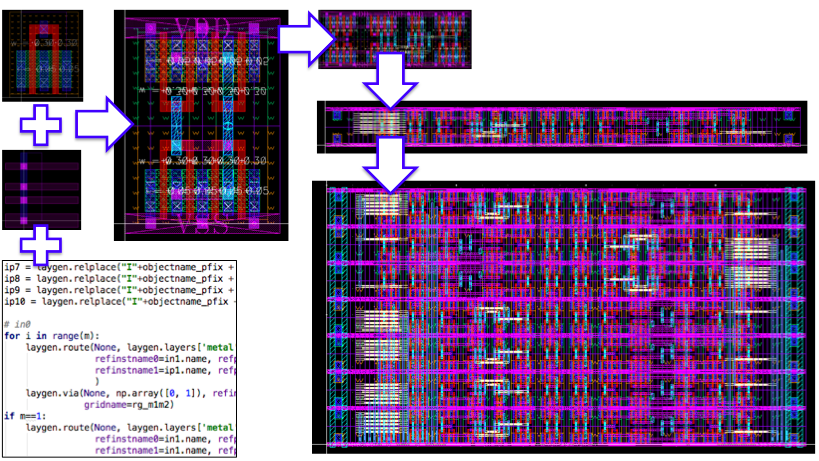
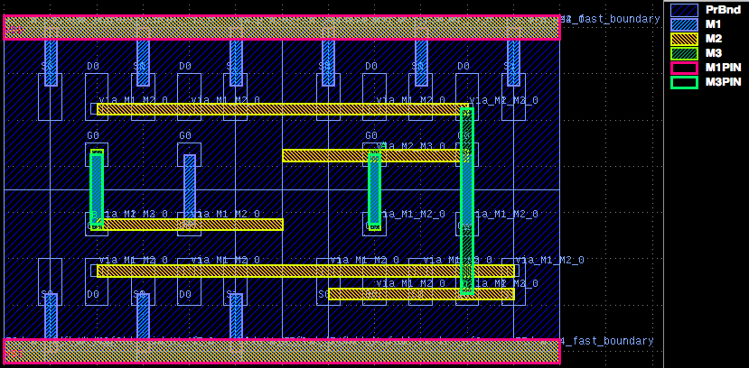

# LAYGO - LAYout with Gridded Objects 

An add-on to [BAG2](https://bwrcrepo.eecs.berkeley.edu/erichang/bag2) framework for layout generation.
With LAYGO, primitive layout parameters are abstracted as templates and grids such that the actual layout job can be done without dealing with complex design rules.
Layout process is abstracted and scripted in python, and with the help of BAG API, LAYGO provides higher productivity and process portability over conventional custom IC design flows.

## Installation
1. install BAG2

2. clone laygo

3. clone tech repo. laygo_config.yaml file is needed for layer/physical grid information and microtemplate library for primitive templates

4. go over lab materials in [labs/](labs/)

More detailed installation instruction can be found in [lab readme](docs/labs.md)

## Quick Start
[quick_start.py](quick_start_GDS.py) will generate a nand gate layout
and save to output.gds.

[KLayout](http://www.klayout.de/) is used for gds display.

## Example Labs
Example training labs can be found [here](docs/labs.md)

## Example Generators
Example generaters can be found [here](docs/generators.md)

## License
This project is licensed under the BSD License - see the [LICENSE](LICENSE) file for details
