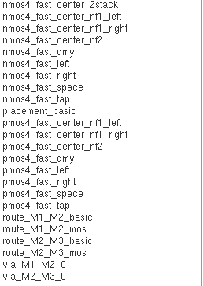
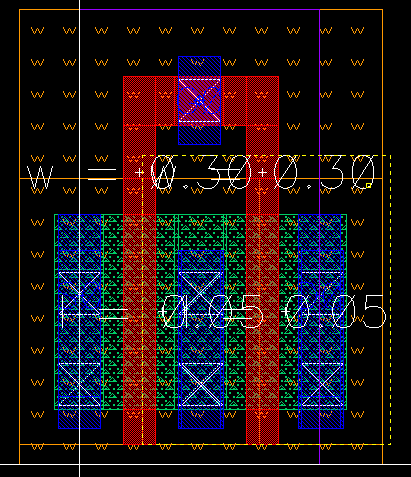
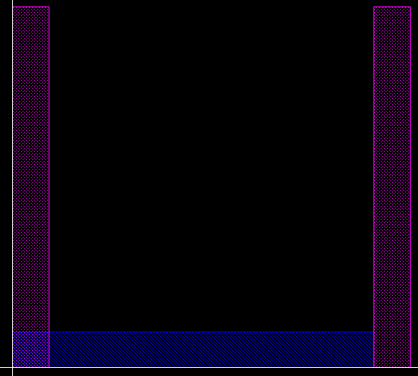
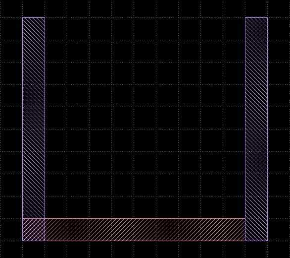

# Laygo practice labs

This document illustrates procedures for running training modules of laygo.
The training modules(labs) are written to help users to get used to the laygo
layout generation flow.

Basically, the entire lab is composed of 2 parts. The first part is
generating layout on physical grids. After completing lab 1, users will
 understand the fundemental layout generation flow of laygo. The second part is
 generating layout on abstracted grid. Users will build custom templates for their
 process, build template and grid database, and place/route objects on their grids.

Each part has several submodules as follows,

Lab1-a : layout export on physical grid

Lab1-b : layout import on physical grid

Lab2-a : construct template DB on abstract grid

Lab2-b : layout export on abstract grid

Lab2-c : logic family template generation

Lab2-d : 2:1 MUX generation on abstract grid

The functions used in the lab modules will be used for layout generation of
real designs. Please make sure users understand how they work and what their
inputs/return values are. More complete generator example will be found [here](generators.md)

## Installation

Before doing the lab modules, users need to install bag setup for their
specific technology. Please note that bag/laygo
does not provide any technology sensitive information to external users without proper
legal agreements.

Installation procedure is explained here

1. After finishing bag setup, clone this repo or make a symbolic link
 in your bag working directory.

2. Copy or make symbolic links of lab scripts from labs/

3. Clone laygo_{technology_name} repo to your bag working directory. The repo contains technology specific
 information and not distributed in public domain.

4. Copy `laygo_config.yaml` from laygo_{technology_name}. If you don't have one, you can create it by yourself. The syntax is as follows.
    ~~~~
    metal_layers:
    - [metal0_layer_name, metal0_layer_purpose]
    - [metal1_layer_name, metal1_layer_purpose]
    - [metal2_layer_name, metal2_layer_purpose]
    - [metal3_layer_name, metal3_layer_purpose]
    ...
    pin_layers:
    - [text_layer_name, text_layer_purpose]
    - [pin1_layer_name, pin1_layer_purpose]
    - [pin2_layer_name, pin2_layer_purpose]
    - [pin3_layer_name, pin3_layer_purpose]
    ...
    prboundary_layer: [prboundary_layer name, prboundary_layer_purpose]
    tech_lib: technology_name
    text_layer: [text_layer_name, text_layer_purpose]
    physical_resolution: physical_grid_resolution
    ~~~~

5. Add `cds.lib` definition of laygo_{technology_name}/{technology_name}_microtemplates_dense
 This library contains primitive templates and grid cells.

6. (optional) copy those files from laygo_{technology_name} to bag working dir
laygo_{technology_name}/{technology_name}_microtemplates_dense_templates.yaml
laygo\_{technology_name}/{technology_name}_microtemplates_dense_grids.yaml
Those files contain template and grid information. This step is optional
because user can generate those files in lab2_a

## Running the Lab - BAG flow

1. Open virtuoso and run bag. You'll see primitive cells in {technology_name}_microtemplates_dense

   

3. Open `nmos4_fast_center_2stack`. You can see an example primitive template of nmos transistor.

   

   The example image is captured from [NCSU-FreePDK45](http://www.eda.ncsu.edu/wiki/FreePDK45:Contents) setup.

4. Make an empty library 'laygo_working'. This is the working library throught the entire lab.
Laygo does not generate libraries automatically. Users need to create working libraries manually or via bag interface.

5. You are ready to run the lab. Run bag and type

   ~~~~
   run lab1_a_baselayoutgenerator_export.py
   ~~~~

   It should create 2 cells in laygo_working. _generate_example_1 should look like this.

   

## Running the Lab - GDS flow
Instead of exporting the design to BAG, laygo can export the output to a gds file.

1. Prepare the layermap file of given technology and make a symbolic link in the working directory.
Usually the layermap can be found in the technology library folder.

2. Prepare the gds file of primitive microtemplates and locate it in the working directory.

3. If you don't have any technology setup, use the default fake technology files in labs.
   Copy them to the working directory

    `laygo_config.yaml` - laygo configure file for fake technology

    `laygo10n_microtemplates_dense_templates.yaml` - laygo template database for fake tech.

    `laygo10n_microtemplates_dense_grid.yaml` - laygo grid database for fake tech.

    If you use fake tech, you can't run lab2_a because there's no real gds file for theh fake technology.
    Use the template/grid database for following labs instead of constructing it in lab2_a

4. Make symbolic links of lab files in the working directory.

5. Run lab1_a and open the resulting gds file. You should see this layout.
    Used [KLayout](http://www.klayout.de/) for gds display.

    
