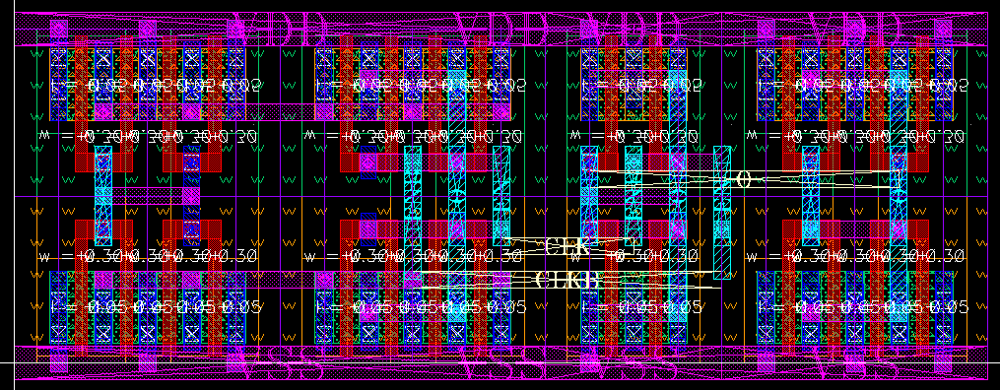

# Logic family generator

This example generates a primitive CMOS logic gate.
The generated library contains logic gate, latch, peripheral cells (tap, spacing)

#### File description

logic_templates_layout_generator.py - layout generation script

logic_templates_schematic_generator.py - schematic generation script

logic_templates_import.py - BAG library import script

BagModules/logic_templates - BAG schematic design module

logic_templates - virtuoso library for logic templates

#### Installation
1. Set up a bag workspace.

2. Set up laygo.
Make sure you have proper laygo_config.yaml in your workspace.
And you should have primitive template & grid libraries & files for your tech.
Check lab2_a_gridlayoutgenerator_constructtemplate.py for reference.

3. Copy or make symbolic links of those files in the bag working directory.

   logic_templates_layout_generator.py

   logic_templates_schematic_generator.py

   logic_templates_import.py

4. Edit cds.lib to read logic_templates library.

   

   You should see
   primitive schematic templates in virtuoso, like this:

   

5. Run bag and bag_logic_import.py. Design modules are generated
 in BagModule/logic_templates.

   

6. Overwrite the generated BagModule files with example files in BagModules/logic_templates

7. Open logic_templates_schematic_generator.py and set impl_lib and params.
impl_lib is the output library name, and param is sizing parameter of
devices

   

7. Run logic_templates_schematic_generator.py. You should see (tech)_logic_templates library is generated.
The library contains all gate schematics/symbols from the dsn script.

   

8. Check if the technology library information (which is set by bag_config.yaml)
is attached correctly. Attach if not.

    

8. Run logic_templates_layout_generator.py. You should see all layouts are generated in the library.

   An example layout of D-latch is shown below.
   [NCSU-FreePDK45](http://www.eda.ncsu.edu/wiki/FreePDK45:Contents) is used for example template construction.

    

<b> If you don't have a bag installation, just run bag_logic_layout.py.
It will automatically export the layout to output.gds. </b>
